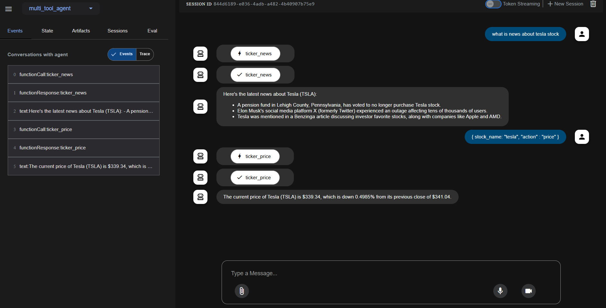

# 📈 Multi-Tool Agent for Stock Analysis

A modular AI-powered agent system built using **Google ADK** that analyzes stock-related queries. It uses the Alpha Vantage API to process natural language queries and fetch real-time stock data, news, and price analytics.


---

## 📁 Directory Structure

```
multi_tool_agent/
├── __init__.py
├── agent.py            # Contains the root agent orchestration
├── .env                # Environment variables for API keys
└── tools/
    ├── __init__.py
    └── tools.py        # Defines all tool-based subagents
```



## 🛠️ Setup Instructions

### 1. Clone the repository

```bash
git clone https://github.com/yourusername/multi_tool_agent.git
cd stock_analysis_agent
```

### 2. Install Python dependencies

```bash
pip install -r requirements.txt
```

### 3. Configure environment variables

Create a `.env` file in the root directory using the provided `.env.example` template.

#### Example `.env`:

```
ALPHA_VANTAGE_API_KEY=your_api_key_here
ALPHA_VANTAGE_BASE_URL=https://www.alphavantage.co/query
```

---

## ▶️ Run the Agent

Ensure you're in the root directory and launch the web interface with:

```bash
adk web
```

Then visit [http://localhost:8000](http://localhost:8000) to interact with the system.

---

## 💬 Example Queries

- “Why did Tesla stock drop today?”
- “What’s happening with Palantir stock recently?”
- “How has Nvidia stock changed in the last 7 days?”

---

## 🧪 Sample Output

```
Stock Analysis for TSLA:

Current Price: $174.32
Change: -$3.17 (-1.79%)

Weekly Performance:
Price moved from $181.12 to $174.32
Change: -$6.80 (-3.75%)
Trend: DOWN

News Sentiment: Negative

Recent News Headlines:
1. Tesla shares dip amid EV demand concerns (Sentiment: Negative)
2. Analysts downgrade Tesla after delivery miss (Sentiment: Negative)
3. Musk hints at layoffs; market reacts (Sentiment: Negative)
```

---

## 📜 License

This project is developed as part of an AI software engineer internship assignment and is intended for educational/demo use only.

---

## 📦 requirements.txt

```
requests
python-dotenv
```
